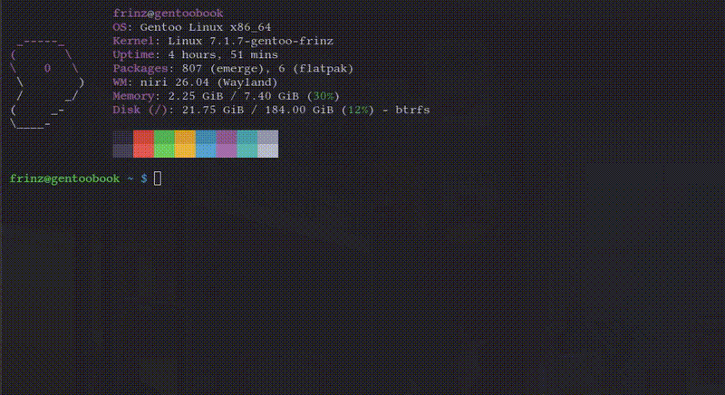

# simple-calc
*A (not so) simple CLI calculator made in Rust.*

This calculator contains the four basic math operations, rounding, other stuff inside advanced mode.

Great if you need a reliable, light calculator to use with assignments or quick calculations.
###### (P.S. don't use this for solving something as hard as the Riemann Hypothesis.)

#### Note from creator
*I don't think simple-calc is so simple anymore...*

## Dependencies
* [clearscreen](https://crates.io/crates/clearscreen) (4.0.6)
* [colored](https://crates.io/crates/colored) (3.1.1)
* [inquire](https://crates.io/crates/inquire) (0.9.4)

## Usage
Just run `simple-calc`, easy as that.
***Note: it does not have CLI arguments.***

## Demo

   
  <i>A demo of simple-calc :)</i>

## Support
It should work on Windows because it uses `std::thread`, `std::time::Duration`,
clearscreen, colored, and inquire, which is cross-platform. However it is not tested
because i use Gentoo Linux (btw).

It definitely works on Linux because that's where i made simple-calc in.

## License
Licensed under .
